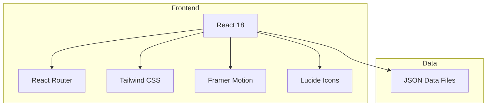

# USTC-InSAR Research Group Website - Technical Architecture

## 1. Architecture Design


## 2. Technology Description
- **Frontend**: React@18.3 + TypeScript@5.8 + Vite@6.3
- **Styling**: Tailwind CSS@3.4
- **Routing**: React Router DOM@7.13
- **Animations**: Framer Motion@12.38
- **Icons**: Lucide React@0.511
- **State Management**: Zustand@5.0
- **Utilities**: clsx, tailwind-merge
- **Build Tool**: Vite@6.3

## 3. Route Definitions
| Route | Purpose |
|-------|---------|
| / | Home page with hero, research highlights, welcome |
| /team | Team members organized by category |
| /research | Research areas and publications |
| /teaching | Courses and teaching resources |
| /news | News and photo gallery |
| /links | Academic profiles and resources |

## 4. Data Structure
Create JSON files for easy content management in `/src/data/`:

### 4.1 Team Members (`team-members.json`)
```typescript
interface TeamMember {
  id: number;
  name: string;
  nameEn: string;
  position: string;
  positionCn: string;
  category: 'associate' | 'postdoc' | 'phd' | 'master' | 'undergraduate';
  email: string;
  research: string;
  photo: string;
  homepage?: string;
  joinYear: number;
}
```

### 4.2 Publications (`publications.json`)
```typescript
interface Publication {
  id: number;
  authors: string;
  title: string;
  journal: string;
  year: number;
  doi: string;
  pdf?: string;
  type: 'journal' | 'conference';
  citations: number;
}
```

### 4.3 News (`news.json`)
```typescript
interface NewsItem {
  id: number;
  date: string;
  title: string;
  category: 'Award' | 'Publication' | 'Event' | 'Other';
  content: string;
  image?: string;
}
```

### 4.4 Courses (`courses.json`)
```typescript
interface Course {
  id: number;
  name: string;
  nameEn: string;
  code: string;
  semester: string;
  description: string;
  syllabus?: string;
}
```

### 4.5 Gallery (`gallery.json`)
```typescript
interface GalleryItem {
  id: number;
  year: number;
  category: 'Group Photos' | 'Conferences' | 'Field Work' | 'Social Events';
  title: string;
  date: string;
  images: string[];
  description: string;
}
```

## 5. Project Structure
```
USTC_InSAR/
├── src/
│   ├── components/
│   │   ├── common/
│   │   │   ├── Header.tsx
│   │   │   └── Footer.tsx
│   │   ├── home/
│   │   ├── team/
│   │   ├── research/
│   │   ├── teaching/
│   │   ├── news/
│   │   └── links/
│   ├── pages/
│   │   ├── Home.tsx
│   │   ├── Team.tsx
│   │   ├── Research.tsx
│   │   ├── Teaching.tsx
│   │   ├── News.tsx
│   │   └── Links.tsx
│   ├── data/
│   │   ├── team-members.json
│   │   ├── publications.json
│   │   ├── news.json
│   │   ├── courses.json
│   │   └── gallery.json
│   ├── hooks/
│   ├── lib/
│   ├── App.tsx
│   ├── main.tsx
│   └── index.css
├── public/
│   └── images/
│       ├── team/
│       ├── gallery/
│       ├── research/
│       └── logo/
├── package.json
├── vite.config.ts
├── tailwind.config.js
└── tsconfig.json
```

## 6. Key Components
- **Header**: Sticky navigation with mobile hamburger menu
- **Footer**: Contact info, quick links, copyright
- **TeamMemberCard**: Individual member display with hover effects
- **PublicationList**: Filterable and searchable publication list
- **Gallery**: Lightbox-enabled photo gallery
