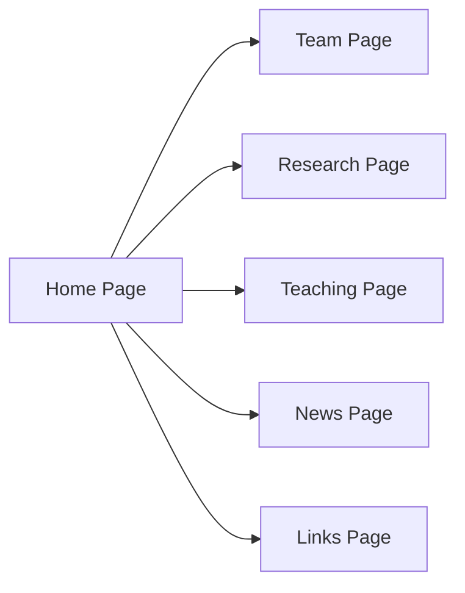

# USTC-InSAR Research Group Website - PRD

## 1. Product Overview
Professional, modern website for USTC-InSAR research group led by Professor Xiaohua Xu, showcasing research, team, publications, and resources.
- Target users: Prospective students, collaborators, researchers, and general public interested in InSAR technology
- Value: Establish academic credibility, facilitate collaboration, and attract talent to the research group

## 2. Core Features

### 2.1 Feature Module
1. **Home page**: Hero section, research highlights, welcome message, quick links
2. **Team page**: Member cards organized by category (associate researchers, postdocs, PhD students, master's students, undergraduates)
3. **Research page**: Research areas, publications with filtering, research highlights
4. **Teaching page**: Courses taught, teaching achievements, student resources
5. **News page**: News section, photo gallery with categories
6. **Links page**: Academic profiles, related websites, useful tools

### 2.3 Page Details
| Page Name | Module Name | Feature description |
|-----------|-------------|---------------------|
| Home page | Hero section | Full-width banner with interferogram background, animated elements, call-to-action buttons |
| Home page | Research highlights | 3-4 main research directions with icons and descriptions |
| Team page | Member cards | Individual cards with photos, names, positions, research interests, contact info |
| Research page | Publications | Filterable by year and type, with authors, title, journal, year, DOI, citations |
| News page | Gallery | Lightbox viewer, image categories, masonry layout |

## 3. Core Process
Users navigate through the website via the header menu, exploring research, team, publications, and other sections. The website supports responsive design for all devices.

## 4. User Interface Design

### 4.1 Design Style
- **Primary Color**: USTC Red (#C41E3A)
- **Secondary Colors**: Gold accents (#FFD700), professional grays
- **Typography**: Clean academic fonts, hierarchical text sizes
- **Layout**: Card-based, top navigation, generous whitespace
- **Icons**: Lucide React icons, consistent style

### 4.2 Page Design Overview
| Page Name | Module Name | UI Elements |
|-----------|-------------|-------------|
| Home page | Hero section | Full-width, gradient overlay, fade-in animations, large typography |
| Team page | Member cards | Grid layout, hover effects (scale, shadow), smooth transitions |
| Research page | Publications | Filter buttons, clean list layout, interactive elements |
| All pages | Header/Footer | Sticky header, consistent branding, quick links |

### 4.3 Responsiveness
Mobile-first approach, responsive breakpoints at <768px, 768-1024px, >1024px, touch-friendly navigation.

### 4.4 InSAR-Specific Graphics
- USTC Logo in header and footer
- Satellite images (NISAR, Sentinel-1) in research sections
- Ridgecrest Coseismic Interferogram as hero background
- Subtle SAR imagery patterns as design elements
